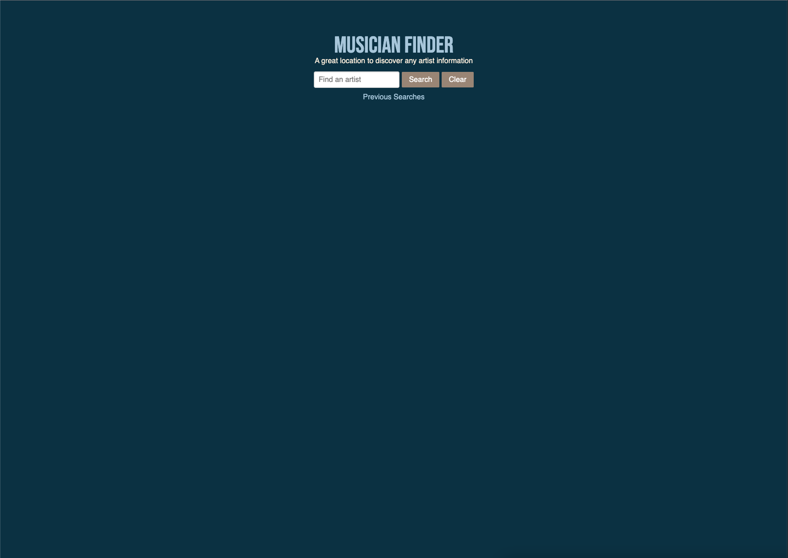

# musician-finder

## Description
Musician Finder is a web application designed to serve as a central hub for music fans to look up their favorite artists and access information about them. Our current feature set includes displaying an artist's picture, top songs, top albums, and any upcoming tour dates. We are also working on adding lyrics and guitar tabs for the top songs in the near future.

In the process of building this application, our team gained valuable experience working with HTML, CSS, and JavaScript to interact with third-party APIs. We also honed our collaboration skills as a small group, learning how to divide the work effectively and manage a GitHub repository.

Try out Musician Finder by visiting our deployed application at: https://reginaldcapanzana.github.io/musician-finder/
Please note that the site may be temporarily unavailable due to an expired API. We are working to resolve this issue as soon as possible.

Thank you for choosing Musician Finder to explore your favorite artists!

## Usage

The user can enter the name of a band or artist in the search bar and click the search button. This will populate the page with information about the artist and create a new button so they can easily search that artist again. There is also a clear button which removes all the information from the page.

## Credits

This application was built by Kimberly Aguilar, Reginald Capanzana, Gabriel Guerin, and Casey Higginbotham.

We used APIs from bandsintown and lastfm. We used PURE CSS as a css framework.

## License

Copyright (c) 2021 Kimberly Aguilar, Reginald Capanzana, Gabriel Guerin, and Casey Higginbotham

Permission is hereby granted, free of charge, to any person obtaining a copy of this software and associated documentation files (the "Software"), to deal in the Software without restriction, including without limitation the rights to use, copy, modify, merge, publish, distribute, sublicense, and/or sell copies of the Software, and to permit persons to whom the Software is furnished to do so, subject to the following conditions:

The above copyright notice and this permission notice shall be included in all copies or substantial portions of the Software.

THE SOFTWARE IS PROVIDED "AS IS", WITHOUT WARRANTY OF ANY KIND, EXPRESS OR IMPLIED, INCLUDING BUT NOT LIMITED TO THE WARRANTIES OF MERCHANTABILITY, FITNESS FOR A PARTICULAR PURPOSE AND NONINFRINGEMENT. IN NO EVENT SHALL THE AUTHORS OR COPYRIGHT HOLDERS BE LIABLE FOR ANY CLAIM, DAMAGES OR OTHER LIABILITY, WHETHER IN AN ACTION OF CONTRACT, TORT OR OTHERWISE, ARISING FROM, OUT OF OR IN CONNECTION WITH THE SOFTWARE OR THE USE OR OTHER DEALINGS IN THE SOFTWARE.
